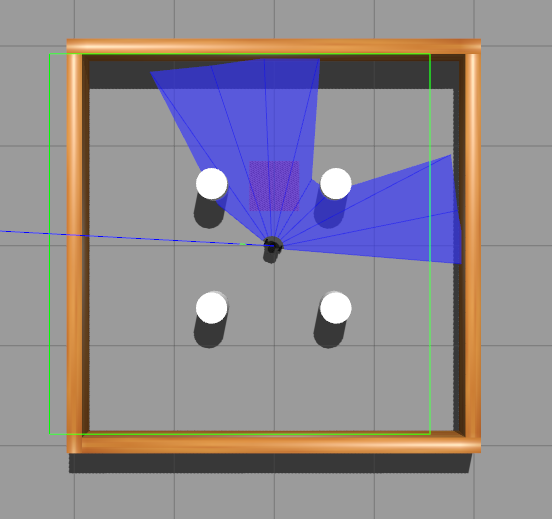

# ddpg_env

Inital version.  Currently runs DDPG using Keras/Tensorflow using ROS and Turtlebot3.  

The code is based on: https://github.com/ROBOTIS-GIT/turtlebot3_machine_learning

The changes made are to use DDPG instead of DPG for the reinforcment algorithm.  The environment manipulator was also rewritten in C++ using boost python (done as a learning excercise).  

The Gazebo simulator was accelerated to shorten training time. 

Examples of the program running are shown below.  The Blue lines are the simulated lidar lines, and the red square is the objective location.  

  
   Turtlebot with simulated lidar lines.

